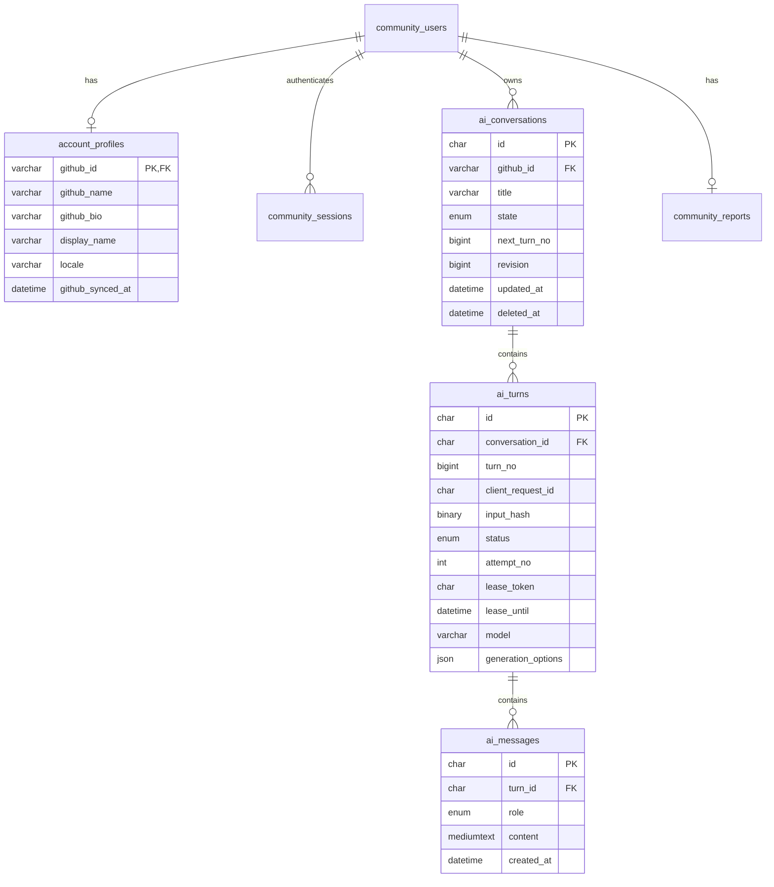

# GitHub 账户与 AI 对话存储设计

状态：设计方案和可执行 DDL，尚未接入运行时或迁移生产数据库。以 2026-09-29 的现有代码为基线。

## 选型结论

继续使用现有 **MySQL 8.4 LTS + InnoDB + mysql2**，账户与聊天放在 `lavamilk_community` 同一业务库，新增四张表。PocketBase 继续负责官网 CMS；会话、私密聊天内容不进入 CMS 公共集合。现有 Node API 是唯一数据库访问入口，浏览器通过带 HttpOnly Cookie 的同源 HTTP 接口访问。

| 选择 | 本项目决策 | 理由与引入条件 |
| --- | --- | --- |
| MySQL 8.4 LTS | 采用并复用现有实例 | 已有账户、会话、报告和运维配置；需要事务、关系约束和索引分页 |
| PostgreSQL | 暂不迁移 | 当前需求没有必须更换数据库的能力缺口，迁移会增加已有账户和报告的风险 |
| MongoDB | 暂不引入 | 消息是有归属、有顺序的关系数据，不需要将整段历史作为大文档覆盖写入 |
| Redis | 首期不引入 | 单实例先用 MySQL 保存任务状态；多个 API/worker 实例或队列延迟成为瓶颈时再评估 |
| 向量库 | 当前不引入 | 保存和重开聊天不需要向量检索；后续知识库检索按独立模块设计 |
| 对象存储 | 附件上线时引入 | MySQL 只保存对象 key、大小、类型和所属账户，文件正文不塞入消息表 |

MySQL 8.4 属于 LTS 系列，数据库升级应选兼容维护版本并验证，而不是随 `latest` 漂移。依据：[MySQL 发布策略](https://dev.mysql.com/doc/refman/8.4/en/mysql-releases.html)。当前 Docker 镜像已使用 digest 固定版本，保留这一方式。

## 现状与兼容策略

`community_users` 已保存 `github_id`、唯一的 `login`、头像和时间；`community_sessions` 保存站内会话 token 的哈希；OAuth 临时状态、扫描任务、当前报告、历史报告也已经在 MySQL。AI 接口现在接收浏览器提交的完整消息数组，刷新后记录消失。

保留 `community_users.github_id VARCHAR(24)` 作为首期账户主键。它对应 GitHub 数值 ID，以字符串传输，不用可变的用户名作为聊天归属依据。现有登录逻辑已处理 GitHub 用户名改名/复用。当前只有 GitHub 登录，无需立即再建一套本地账户 ID 和身份映射；将来真正接入其他登录提供商时再引入 `users` 和 `user_identities(provider, subject)`，通过映射迁移而不是按 email 自动合并账户。

新增资料记录通过 OAuth 成功后的 GitHub `/user` 结果白名单同步，仅取 name、bio、company、location、blog、created_at 等必要字段。GitHub 字段与站内 `display_name`、语言偏好分开，后续登录不覆盖用户自定义昵称。可空字段保持 NULL，不捏造 email 或把 GitHub 未公开邮箱当作已验证联系方式。继续不落库 GitHub access token 和完整 OAuth 响应。字段来源：[GitHub 用户 API](https://docs.github.com/en/rest/users/users#get-the-authenticated-user)。

## 数据模型



完整字段、外键、检查约束及索引见 [account-chat.sql](account-chat.sql)。一轮 `turn` 包含一条用户消息和至多一条 AI 回复。生成失败时保留用户输入和错误状态，不能伪造空的成功回复。用户界面的“对话列表”是 conversations；“消息记录”是 messages；是否生成中、能否重试、用哪个模型则由 turns 管理。

| 表 | 关键字段及用途 |
| --- | --- |
| `account_profiles` | 与现有账户 1:1；GitHub 资料快照、站内昵称、语言及同步时间 |
| `ai_conversations` | UUID、账户 ID、标题、归档状态、软删除时间、排序计数和乐观锁 revision |
| `ai_turns` | 轮次、幂等请求 ID、输入摘要、生成状态、尝试次数、执行租约、模型/提示词版本、参数、token 用量和耗时 |
| `ai_messages` | 独立 UUID、所属轮次、user/assistant 角色、正文；同一轮同一角色只能有一条 |

所有新时间字段用 UTC `DATETIME(6)`；数据库连接显式设 UTC。新 UUID 用规范化的小写字符串 `CHAR(36) ASCII`，便于现有 Node `randomUUID()` 使用；表之间的 FK 类型、字符集及排序规则完全一致。既有 github_id 继续保持当前格式，不做在线主键替换。API 中大整数以字符串输出，避免 JavaScript 精度丢失。

消息正文用 `MEDIUMTEXT`，数据库限制单条最多 64 KiB；HTTP 入口仍需字符数、字节数和请求体限制，数据库 CHECK 只是最后一道完整性保护。首期保留当前用户输入 6000 字符、上下文总计 12000 字符/21 条及输出上限；后续有 tokenizer 后改按 token 预算裁剪。列表不用 `SELECT content`，正文只在打开会话时读取。JSON 只保存少量非敏感生成参数，不保存整段消息历史或任意上游响应。

## 索引和关键不变量

- 会话列表：`(github_id, deleted_at, state, updated_at DESC, id DESC)`，单页 30 条，使用 `(updated_at,id)` 游标；活动/归档分别查询。分页期间会话有更新会改变排序，客户端按 ID 去重，刷新首屏获取最新顺序。
- 时间线：`(conversation_id,turn_no)` 唯一索引。按轮分页，每页 20 轮，再取对应 messages 并按 user、assistant 排序；不用时间戳决定发言先后。
- 请求去重：`(conversation_id,client_request_id)` 唯一；相同 key + 相同输入摘要返回已有 turn，相同 key + 不同输入返回 409。
- 生成并发：`active_slot` 在 pending/running 时为 1，结束时为 NULL；`UNIQUE(conversation_id,active_slot)` 让一个会话最多一个待处理或运行轮次。多个已结束轮次的 NULL 可以共存，已用真实 MySQL 验证。
- 恢复任务：`(status,lease_until,id)` 找过期运行任务，`(status,created_at,id)` 找待执行任务。新消息不因进程重启丢失。
- 级联清理：物理删除 conversation 会删除 turns 和 messages；删除账户前必须显式处理 conversations，避免误删账户时无提示清空聊天。

FK/UNIQUE/CHECK 只能保证结构完整性，**不能代替用户鉴权、状态机和跨行完整性**；例如“completed 必须有一条 assistant 回复”由应用同一事务完成。MySQL 外键的类型、排序规则要求及 CHECK 行为见 [外键文档](https://dev.mysql.com/doc/refman/8.4/en/create-table-foreign-keys.html)、[CHECK 文档](https://dev.mysql.com/doc/refman/8.4/en/create-table-check-constraints.html)。

## 请求、事务和失败恢复

首期保持纯文本问答，完成后一次返回正文；历史存储与日后 SSE 流式输出可共用同一结构。

1. 浏览器 POST 当前用户输入、conversation ID 和随机 `clientRequestId`；身份只取已验证会话。客户端不提交 github_id、历史 assistant 消息或模型 URL。
2. 短事务锁定该用户的 conversation 行，检查未删除、未归档；先查幂等 key，再检查是否已有活动 turn。分配 `next_turn_no`，写入 pending turn 和 user message，更新会话计数/revision，提交。数据库写入失败时不调用模型。
3. 接口返回 202 和 turn ID。应用内 worker 从 MySQL 领取 pending 项，通过条件更新改为 running，写随机 lease_token、120 秒租约及 started_at 后提交。上下文从数据库加载同一账户、同一会话中已完成的轮次，以及当前用户输入；仅裁剪送模型的上下文，不删历史。
4. 在数据库事务外调用现有模型适配器，继续保持 90 秒上限。首期只运行一个模型 worker，扫描与聊天仍共享现有单并发模型门；模型忙可短期等待/重试，达到等待期限后标记 failed，不能无限占 pending 槽位。
5. 成功后按“先 conversation、再 turn”的固定顺序锁行，校验账户、deleted_at、状态和 lease_token。一次事务写 assistant message、用量/耗时，标记 completed、清空租约，更新 conversation 的更新时间/revision。提交后客户端才收到成功；提交前服务崩溃不宣称已保存。
6. 模型失败、取消或超时将 turn 标记 failed/cancelled、记录白名单 error_code、清空租约和写 finished_at；保留 user message。过期 running 租约由周期任务标记 failed(interrupted)，不自动反复重新计费。pending 等待上限初始设 120 秒，也须有回收任务。
7. 用户主动重试通过 `expectedAttempt` 做 compare-and-set，只有指定的失败轮次仍是会话最后一轮、无其他活动轮次且 attempt_no 匹配才能增至下一次 pending；清空旧时序、错误与用量字段，保留原 user message。重复重试请求返回当前状态，避免同一轮被重跑两次。已有后续轮次时返回 409，用户可复制问题开启新一轮。

执行结果只能由当前 lease_token 写回；旧 worker 晚到的响应被拒绝。删除会话与完成生成使用同一锁顺序：删除立即取消未完成轮次，软删除后不再接受新生成和旧结果。

数据库与外部模型无法组成同一事务：网络故障、租约过期后的人工重试仍可能导致模型被调用两次。这里保证消息不重复落库、结果不互相覆盖，不承诺外部调用 exactly-once。`ai_turns` 的用量字段保存最近一次尝试的可获知用量，NULL 表示模型未提供，不能当作 0；如果以后收费，另建不可变的 attempt/usage ledger，每次重试单独记账。

与当前代码的行为变化：页面断线不会自动删除或取消已受理的持久任务；前端恢复后查询 turn 状态。“停止生成”需显式 cancel 接口并标记 cancelled。浏览器关闭不是取消指令。执行中租约按实际实现心跳续期，续期只允许匹配 token 的当前执行者。

## 接口与访问边界

为兼容现有 Cookie 的 `Path=/api/pig-king`，首期接口保持该前缀，不直接改成 Cookie 无法携带的 `/api/chat`。数据库表名独立于 URL，以后可统一改名迁移。

| 接口（前缀 `/api/pig-king`） | 行为 |
| --- | --- |
| `GET /me/profile`、`PATCH /me/profile` | 读取资料；只允许修改站内昵称/语言，GitHub 身份字段不可客户端修改 |
| `GET /chat/conversations` | 当前用户会话列表，活动/归档过滤和游标分页 |
| `POST /chat/conversations` | 新建会话，客户端生成 UUID；重复相同 ID 的自有会话返回现有记录 |
| `PATCH /chat/conversations/:id` | 改标题/归档，要求 expectedRevision；竞争修改返回 409 |
| `DELETE /chat/conversations/:id` | 当前用户软删除，取消未完成任务 |
| `GET /chat/conversations/:id/turns` | 按轮读取历史与生成状态，消息包含在各轮中 |
| `POST /chat/conversations/:id/turns` | 持久化用户输入并受理生成；首次 202，重复 key 返回已有状态 |
| `POST /chat/conversations/:id/turns/:turnId/retry` | 受 expectedAttempt 保护的失败重试 |
| `POST /chat/conversations/:id/turns/:turnId/cancel` | 幂等取消；已完成则返回已完成，不删除回复 |

所有会话/轮次读取、修改、重试、导出都带所有者约束，例如：

```sql
SELECT m.id, m.role, m.content, t.turn_no, t.status
FROM ai_conversations AS c
JOIN ai_turns AS t ON t.conversation_id = c.id
JOIN ai_messages AS m ON m.turn_id = t.id
WHERE c.id = ? AND c.github_id = ? AND c.deleted_at IS NULL
  AND t.turn_no > ?
ORDER BY t.turn_no, FIELD(m.role, 'user', 'assistant');
```

上例演示归属检查；实际先分页轮次、再批量加载这些 turn 的 messages，避免截断成半轮。UUID 不是授权凭证；他人 ID 和不存在的 ID 均返回 404，未登录返回 401。写操作继续校验 Origin、SameSite/HttpOnly Cookie、请求体大小及速率。消息/资料响应 `Cache-Control: no-store`，日志不记录聊天正文、Cookie 或 OAuth token。昵称、资料与 Markdown 均按不可信文本渲染，链接协议只允许 http/https。

模块依赖维持：`server/community/index.js` 是外部入口；HTTP 编排、聊天任务和 MySQL 存储在 `lib` 内协作，测试通过 HTTP 入口验证。独立聊天前端只从自己的 `api.js` 调用接口，不直接读取数据库或导入服务端源码。DDL 是独立迁移输入，不能在 `openStore()` 每次启动时自动执行。

## 保留、备份和扩容

初始建议：聊天默认一直保存到用户删除；删除即从所有用户接口隐藏，7 天后分批物理清除。备份中的副本随 30 天保留周期到期清理；这两项是待产品确认的策略，不是已上线的承诺。GitHub 新资料在成功登录时更新，首次为旧账户创建空资料行，下一次登录补齐。不要把未同步状态显示成“资料为空”。

注销账户需单独流程：撤销所有会话，停止生成，清理 profiles/conversations，再按业务保留政策处理既有 reports、report_history、jobs 和 legacy 数据。现有 history/jobs 没有账户外键，不能仅依赖级联删除；不在本次加表时顺手改动已有报告保留逻辑。

沿用单机实例和已有连接池（5）作为起点。当前 MySQL 容器 512 MiB 上限/128 MiB buffer pool 只作为现状，不宣称足以承载某个用户数；用真实写入、分页与并发生成压测后调整。示例容量预算：1000 日活 × 20 轮/天 × 2 条/轮 × 平均 2 KiB ≈ 78 MiB 正文/天、2.3 GiB/30 天，尚未包含索引、备份、binlog 和预留空间；这是输入假设，不是测量结果。

配置每日一致性备份、加密的异机保存和定期恢复演练；仅每日备份时 RPO 目标最多 24 小时。需要更低 RPO 时再启用并验证持续 binlog 归档和时间点恢复，不能把同盘的 Docker volume 或部署文件备份当作数据库备份。RTO 初始目标 2 小时，必须靠恢复演练验证。空间告警建议 70%/85%，同时观测数据库大小、备份年龄、连接池等待、慢查询、队列最长等待和过期租约数。

先通过索引与分页解决问题；连接池等待持续升高、写入延迟或单机恢复时间超过目标时再评估增加内存、托管 MySQL 或读副本。需要多个模型 worker 时，将全局模型容量限制迁到可共享的租约/队列机制；现有进程内 busy 标志不能充当分布式锁。

## 迁移与发布步骤

1. 核对 MySQL 8.4、数据库/连接 UTC、`community_users.github_id` 的字段长度和排序规则。DDL 以 `utf8mb4_0900_ai_ci` 为前提；不同则让新增 FK 字段匹配实际值，不能直接改既有账户主键。
2. 在独立测试库执行 DDL 和约束测试；恢复一份脱敏生产快照再次排练。建立独立 migration ledger，保存版本和脚本 checksum，由单独迁移账号执行；运行账号逐步只保留必要 DML 权限。现有启动时 CREATE TABLE 需要先迁出，否则直接撤销 DDL 权限会导致启动失败。
3. 在生产创建一致性数据库备份并确认能恢复；以人工受控迁移执行这四张新增表。DDL 不包成假事务：MySQL 的 CREATE TABLE 等操作会隐式提交，多条 DDL 不是一个可整体 rollback 的事务；中途失败应检查已建表并按迁移记录恢复执行。[MySQL 隐式提交规则](https://dev.mysql.com/doc/refman/8.4/en/implicit-commit.html)
4. 部署兼容旧接口的新后端，开启账户资料持久化和新会话接口；前端随后接入列表、历史加载、新建/删除和刷新恢复。旧 `POST /chat` 在过渡期明确保持旧行为，不从浏览器提供的 assistant 内容导入“可信历史”。用户如需导入旧页面内容应使用明确标注的独立导入流程。
5. 验证 A/B 两账户隔离、GitHub 改名、刷新/重新登录、重试幂等、多标签竞争、模型中断、取消和删除后晚到回复。再逐步打开新界面。
6. 应用回滚保留新表及数据，关闭新入口即可；不自动 DROP 数据。需要删除试验数据必须单独确认范围。

当前 CI/CD 的部署包不包含 docs 下的 DDL，也不自动运行数据库迁移；`mysql.js` 改动还会被服务器 guard 拦截。真正接入时需要补充 schema version 的只读检查并按上述步骤迁移后更新基线，不能简单删除 guard 来让部署绿灯。

## 本次验证与后续验收

`server/community/tests/account-chat-schema.test.js` 通过现有应用公开入口建立基线表，然后直接执行本设计 DDL，在临时 MySQL 8.4 上验证外键、Unicode、唯一约束、并发活动槽、租约条件更新、所有者过滤查询和级联删除。它验证的是数据库设计；尚未有新 HTTP 接口，因此不等于前后端持久化功能已完成。运行：`npm run test:integration`。

实施阶段还需通过真实 HTTP + MySQL 验证不能跨账户读取/写入，并为刷新恢复、会话列表和失败重试补浏览器测试。当前已存在的界面、CMS 和猪猪榜测试继续保留。
